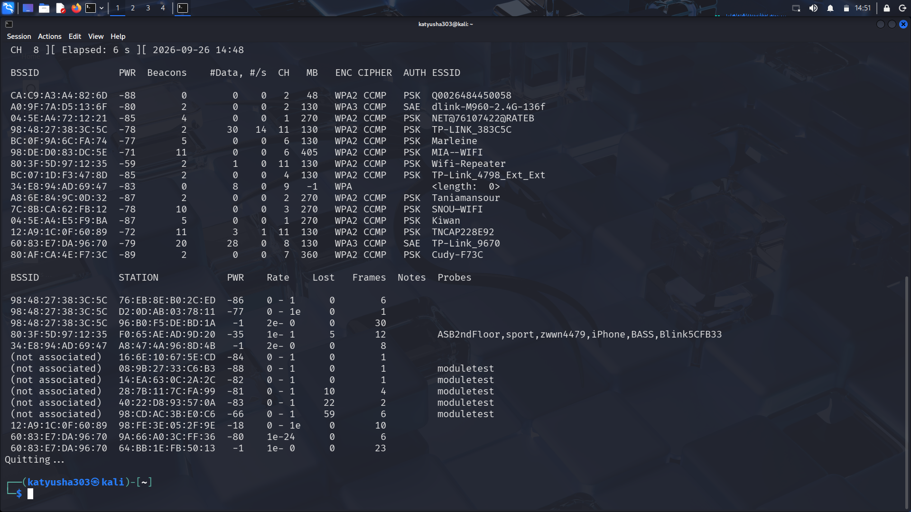
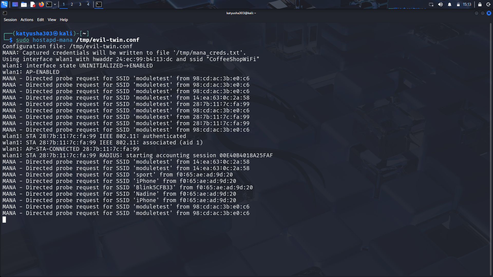
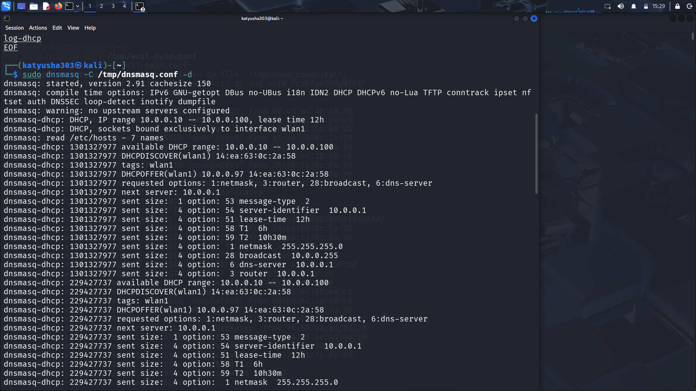
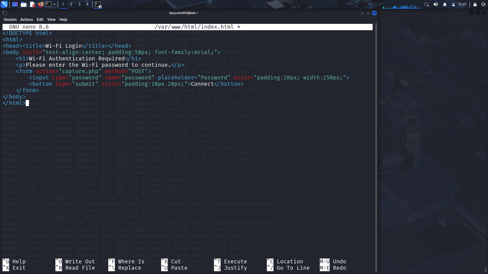
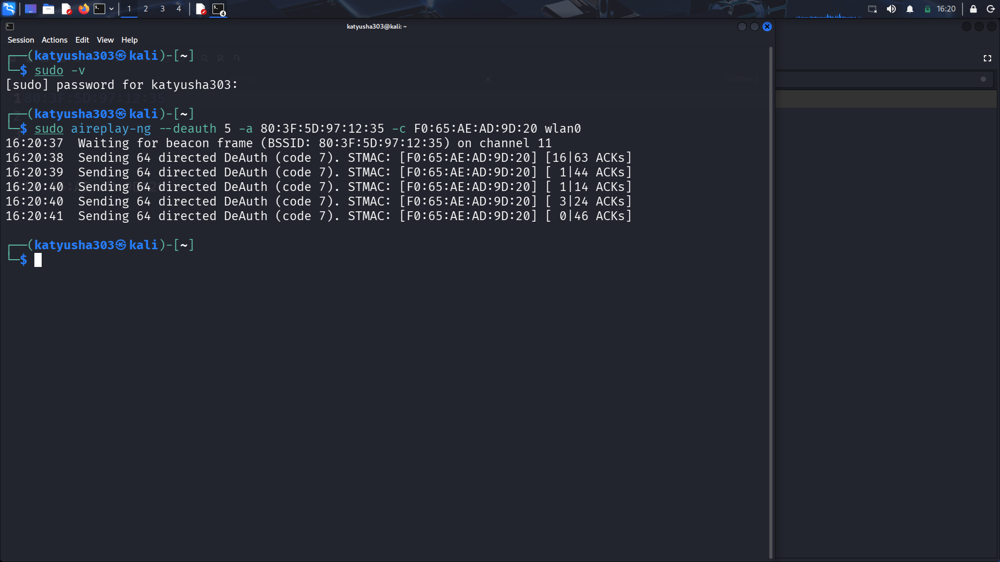
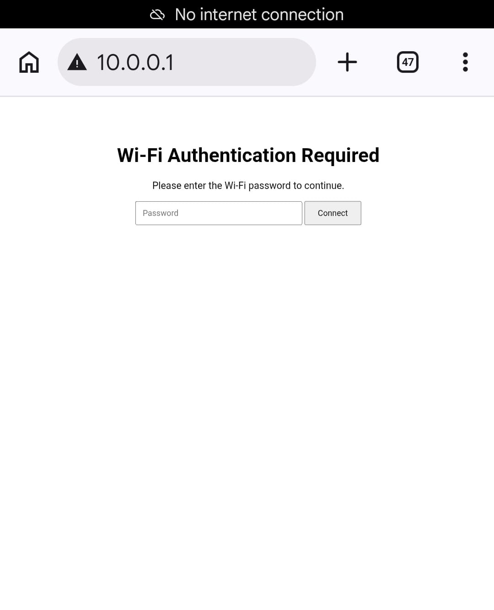
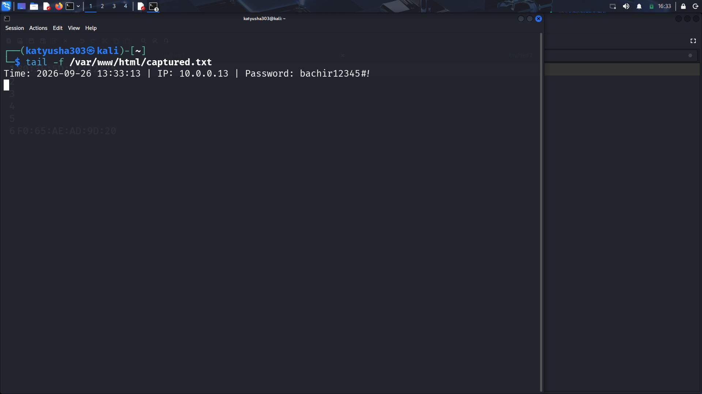

# Methodology

## Lab Setup 

### Kali Linux VM in Oracle VirtualBox
The attacker machine was a Kali Linux virtual machine running in Oracle VirtualBox on a Windows host. VirtualBox was chosen for its USB passthrough capability, which allows physical wireless adapters to be attached directly to the guest OS. This setup keeps the attack environment isolated from the host system while still giving Kali full control over the wireless hardware. The VM was configured with a bridged network adapter, allowing it to appear as a separate device on the local network.

### Two Wi-Fi Adapters (Models, Chipsets)
Two wireless adapters were used to separate the attack into distinct roles. The first adapter was a Qualcomm Atheros AR9271-based USB card, used for monitor mode, scanning, and packet injection (deauth attacks). The second adapter was used in AP mode to broadcast the Evil Twin network. Separating these roles is essential because a single adapter cannot perform monitor mode and AP mode simultaneously — doing so causes the fake access point to crash or fail. Both adapters were connected through a powered USB-C hub to ensure stable power delivery during the attack.

### Target Device
The target device was an Android smartphone connected to a home WiFi Repeater configured as the legitimate access point. The WiFi Repeater served as the "CoffeeShop WiFi" network being cloned, and the phone acted as the victim device that was deauthenticated and forced to reconnect to the Evil Twin. Using a personal WiFi Repeater and phone ensured the entire test was conducted on owned equipment, with no third-party involvement.

### VirtualBox Network Configuration
The VirtualBox network was configured with a bridged adapter to give the Kali VM its own presence on the LAN, separate from the host machine. USB passthrough was enabled for both wireless adapters so they could be controlled directly by Kali. This configuration allowed the VM to transmit Wi-Fi frames, host a rogue AP, and intercept traffic — all while remaining isolated from the host operating system.

## Tools Used

### airmon-ng 
A script within the Aircrack-ng suite used to enable and disable monitor mode on wireless adapters. It also detects and kills interfering processes like NetworkManager that can disrupt packet capture.

### airodump-ng
The scanning and packet capture tool in the Aircrack-ng suite. It discovers nearby access points and connected clients, displaying their BSSID, channel, encryption, and signal strength.

### aireplay-ng
The packet injection tool in the Aircrack-ng suite. In this project, it was used to send deauthentication frames, forcing the target device off the legitimate network.

### hostapd-mana
A modified version of hostapd that creates a rogue access point. It supports the MANA attack, which responds to client probe requests, making the fake AP more convincing to nearby devices.

### dns-masq
A lightweight DHCP and DNS server. In this project, it assigned IP addresses to victims connecting to the fake AP and redirected all DNS queries to the attacker's machine, triggering the captive portal.

### Apache2
A widely used open-source web server. It hosted the fake captive portal page that victims were redirected to.

### PHP
A server-side scripting language used with Apache. The capture script was written in PHP to receive and log submitted credentials.

## Step by Step walk-through of the attack

### Step 1:Reconnaissance
Our goal here is to gather info on the network's BSSID,ESSID, and channel.
First of all the "sudo airmon-ng start wlan0" command is run to put the wlan0 card in monitor mode. 
After that "sudo airodump-ng wlan0" is called to start showing us the networks and all their related info, as seen in the screenshot.
Our target of interest is the "Wifi Repeater" network which is shown below the SSIDs , and with it goes its BSSID and channel name.
Note that in the second, lower section, our target network's BSSID is displayed and next to it is a MAC address under the value "channel". This refers exactly to our target phone(my phone in this case) which is connected to the Wifi Repeater network.

### Step 2 : Stand Up the Evil Twin (Fake AP)
Our next step is to broadcast a fake AP with the same name,channel, and frequency as the targeted network.
We will use a tool named hostapd-mana which will clone for us the fake AP using the following commands for the fake AP file configuration:
cat > /tmp/evil-twin.conf << 'EOF'
interface=wlan1
driver=nl80211
ssid=CoffeeShop WiFi
hw_mode=g
channel=6
mana_enable=1
mana_credout=/tmp/mana_creds.txt
EOF

Then we will run "sudo hostapd-mana /tmp/evil-twin.conf" and as the screenshot shows, AP-ENABLED showed in the terminal which means the AP is cloned. The second screenshot shows the ESSID of the cloned AP on the victim's mobile (mine).

### Step 3:  DHCP and DNS Trap
Our goal now is to give all connected devices to the fake AP, an IP address to make the process look legit, and to redirect all traffic through our laptop which is imortant later on eavesdropping(will be explained later).
An important tool that we will use is dnsmasq, a tool that will allow the AP to have its own dhcp server and start asigning IP addresses to connected victims. 
As seen in the screesnhot, a victim is already connected and received an IP address (10.0.0.97) from our fake network. That 14:ea:63:0c:2a:58 is one of the devices that connected to the Evil Twin. Phase 3 is complete and working.

### Phase 4 : Hosting the captive portal
Now is time to set up the fake portal to really trick or social-engineer the victim in entering his credentials into the portal hosted by the fake AP.
To achieve this we will initiate two files , an index.html file to show to portal , and in it a form requesting for a password, and a capture.php file that will send the entered credetials back to the laptop using a php script.
The below screenshots show the code written to achieve this objective:

### Phase 5:  Force the Victim (Deauth Attack)
Now comes the real fun, which is kicking the victim from the real legitamite AP and force him to reconnect to the fake AP. This will be done using a tool aireplay-ng which is one of the derivatives of aircrack-ng.
The victim will directly reconnect to the fake AP since the phone's OS is set to reconnect to the connection according to the name. Since the fake AP'S name is the same , and the fake AP is set to be closer to the victim (sending more beacons) , this will "seduce" the phone into reconnecting to the fake AP.
The provided screenshot shows the commands and process.Note "sending de-auth packets..." which confirms the attack is successful.

The follwoing screenshot shows the victim phone that disconnect from the legit AP and reconnected to the fake one.

### Phase 6 : Credential Harvest
The last phase is capturing the vitim's sensitive information he entered.
By entering "tail -f /var/www/html/captured.txt" we are waiting for the victim to enter the password.
And once the victim has entered the password, you can see in the screenshot, that a log has been generated in the kali terminal showing the exact time and IP address the password was entered, along with the password itself.
